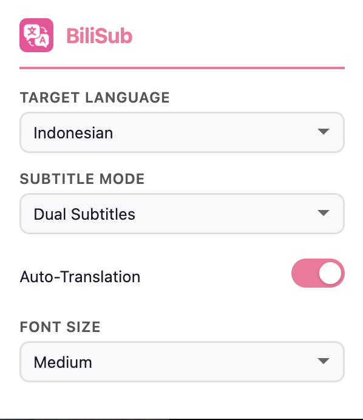
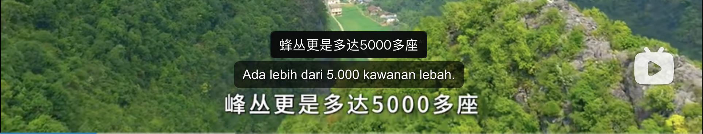
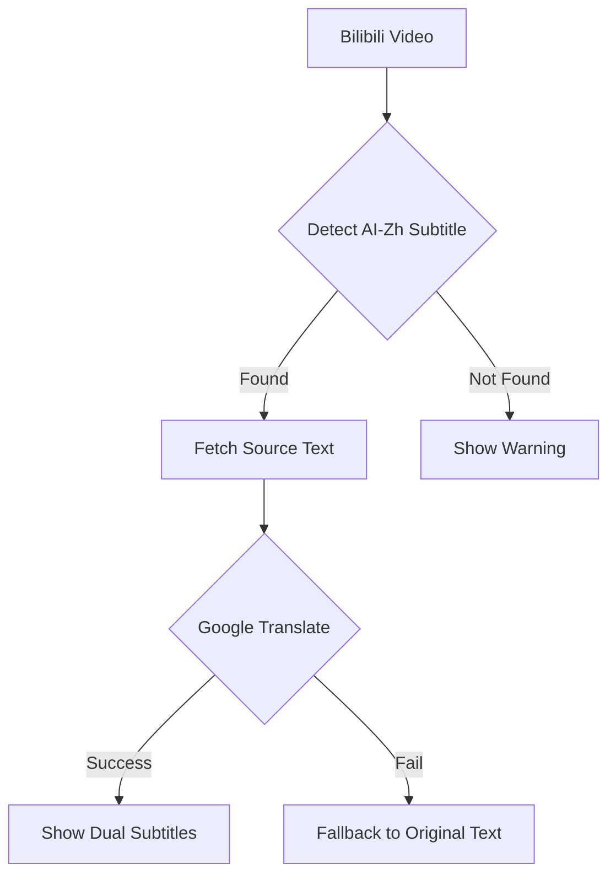

# 🌏 BiliSub

```
██████╗ ██╗██╗     ██╗███████╗██╗   ██╗██████╗ 
██╔══██╗██║██║     ██║██╔════╝██║   ██║██╔══██╗
██████╔╝██║██║     ██║███████╗██║   ██║██████╔╝
██╔══██╗██║██║     ██║╚════██║██║   ██║██╔══██╗
██████╔╝██║███████╗██║███████║╚██████╔╝██████╔╝
╚═════╝ ╚═╝╚══════╝╚═╝╚══════╝ ╚═════╝ ╚═════╝ 

🔄 Real-time Translation | 🌍 Multi-language
```

[](./LICENSE)


**English** | [Indonesian](./README_ID.md) | [中文](./README_ZH.md)

> 🚀 A Chrome/Edge extension that adds real-time multi-language subtitles to Bilibili videos using Google Translate. Fire-and-forget translation that just works!

---

## 📷 Preview

| Popup Settings | Dual Subtitles in Action |
|:---:|:---:|
|  |  |

---

> [!NOTE]
> 🤝 **Project Origins**
>
> **BiliSub** is built on two main sources of inspiration:
> - [**Bilibili Double Subtitle**](https://github.com/zhutoutoutousan/bilibili-double-subtitle) — **Core foundation**. The dual-subtitle architecture, player subtitle detection mechanism, and Bilibili API integration are adopted from this project as the base.
> - [**Immersive Translation**](https://github.com/immersive-translate) — **Realtime tuning reference**. High-precision translation concepts, zero-lag approach, and immersive UX were studied from this project then adapted for Bilibili use case precision.
>
> The result is a lightweight, fast extension focused on a smooth Bilibili watching experience.

## ⚠️ Requirements

> [!IMPORTANT]
> **BiliSub requires AI-Generated Chinese (AI-Zh) subtitles** to translate.
>
> This extension automatically detects and enables the `ai-zh` / `zh-CN` subtitle track from Bilibili videos. If a video **does not have AI-generated subtitles**, translation will not work because there is no source text to translate.
>
> Most Bilibili videos already have AI-Zh subtitles. If not, make sure the video creator has enabled the AI subtitle feature.

## ✨ Features

- 🔄 Real-time subtitle translation
- 🔘 **Toggle On/Off** — enable/disable auto-translation anytime via popup
- 🌍 Support for 100+ languages
- 🎯 Dual mode: show original + translated subtitles, or translation only
- 🎨 Adjustable font size (Small / Medium / Large)
- 🔥 UDP-style reliability (keeps going no matter what)
- 🎬 Clean & polished subtitle styling
- ⚡ Instant fallback to original text if translation fails
- 🛠 No API key required
- ✅ Auto-enables AI-Zh subtitle when video loads

## 🚀 Installation

1. Download or clone this repository
2. Open Chrome, go to `chrome://extensions/`
3. Enable **Developer mode** in the top right corner
4. Click **Load unpacked** and select this extension folder
5. Open any Bilibili video — translations appear automatically!

**For Edge:** Same as Chrome, open `edge://extensions/` and follow the same steps.

> [!TIP]
> **Not yet available on Extension Stores**
>
> Currently BiliSub can only be installed manually (Load Unpacked). Plans to publish to Chrome Web Store & Microsoft Edge Add-ons are in the roadmap.

## 🎮 Usage

1. Click the **BiliSub** icon in your browser toolbar
2. Select your **target language** from the dropdown
3. Use the **Auto-Translation switch** to toggle translation on/off
4. Choose **Subtitle Mode**: Dual Subtitles (original + translation) or Translation Only
5. Adjust **Font Size** as needed
6. Done! Translations appear below the original subtitles in real-time

## 🌍 Supported Languages

<details>
<summary>Click to expand full list</summary>

- Afrikaans
- Albanian
- Amharic
- Arabic
- Armenian
- Azerbaijani
- Basque
- Belarusian
- Bengali
- Bosnian
- Bulgarian
- Catalan
- Cebuano
- Chinese (Simplified) / 中文(简体)
- Chinese (Traditional) / 中文(繁體)
- Corsican
- Croatian
- Czech
- Danish
- Dutch
- English
- Esperanto
- Estonian
- Finnish
- French
- Frisian
- Galician
- Georgian
- German
- Greek
- Gujarati
- Haitian Creole
- Hausa
- Hawaiian
- Hebrew
- Hindi
- Hmong
- Hungarian
- Icelandic
- Igbo
- Indonesian / Bahasa Indonesia
- Irish
- Italian
- Japanese / 日本語
- Javanese / Basa Jawa
- Kannada
- Kazakh
- Khmer
- Korean / 한국어
- Kurdish
- Kyrgyz
- Lao
- Latin
- Latvian
- Lithuanian
- Luxembourgish
- Macedonian
- Malagasy
- Malay
- Malayalam
- Maltese
- Maori
- Marathi
- Mongolian
- Myanmar (Burmese)
- Nepali
- Norwegian
- Nyanja (Chichewa)
- Odia (Oriya)
- Pashto
- Persian
- Polish
- Portuguese
- Punjabi
- Romanian
- Russian
- Samoan
- Scots Gaelic
- Serbian
- Sesotho
- Shona
- Sindhi
- Sinhala
- Slovak
- Slovenian
- Somali
- Spanish
- Sundanese / Basa Sunda
- Swahili
- Swedish
- Tagalog (Filipino)
- Tajik
- Tamil
- Telugu
- Thai / ภาษาไทย
- Turkish
- Ukrainian
- Urdu
- Uzbek
- Vietnamese / Tiếng Việt
- Welsh
- Xhosa
- Yiddish
- Yoruba
- Zulu

</details>

## 🛠 Technical Details

The extension uses a "UDP-style" translation approach:



**How it works:**
1. The extension injects an interceptor into the Bilibili page to capture subtitle data
2. It automatically finds and enables the **ai-zh** (AI-Generated Chinese) subtitle track
3. Each subtitle line is translated via Google Translate API in real-time
4. Translation results appear below the original subtitle (dual subtitle mode)
5. If translation fails, the original text is still shown (graceful degradation)

## 🔮 What's Next

> [!TIP]
> Future development plans for **BiliSub**:

- **OCR Translation** — Main feature being worked on. Enables subtitle translation for videos that **don't have AI-generated subtitles**, by capturing text that appears on screen (hardsub / embedded subtitle) via OCR then translating it in real-time.
- Publishing to **Chrome Web Store** & **Microsoft Edge Add-ons** for easier installation
- Support for **multiple translation engines** (DeepL, LibreTranslate, in addition to Google Translate)
- **Export subtitles** to .srt / .ass format

---

## 🤝 Contributing

Contributions are welcome! Feel free to:

1. Fork this repository
2. Create a feature branch
3. Submit a pull request

## 📝 License

MIT License — free to use in your own projects!

---

<div align="center">
Made with ❤️ for the Bilibili community
<br>
🌟 Star us if you find this useful!
</div>
