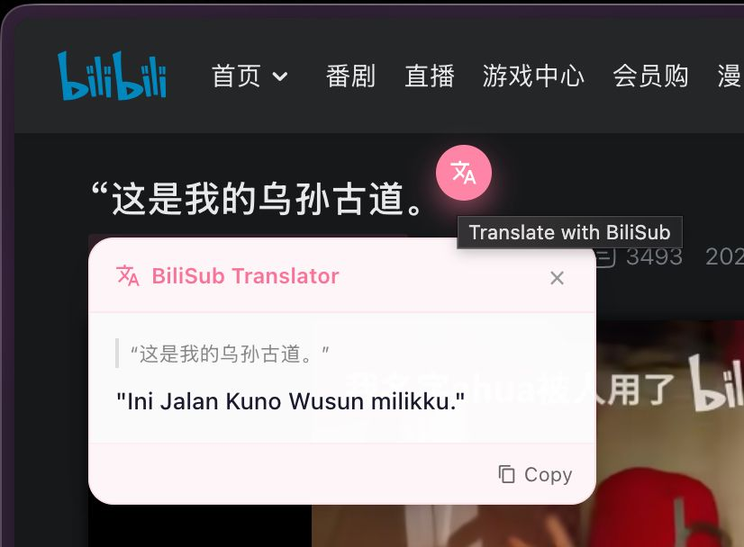
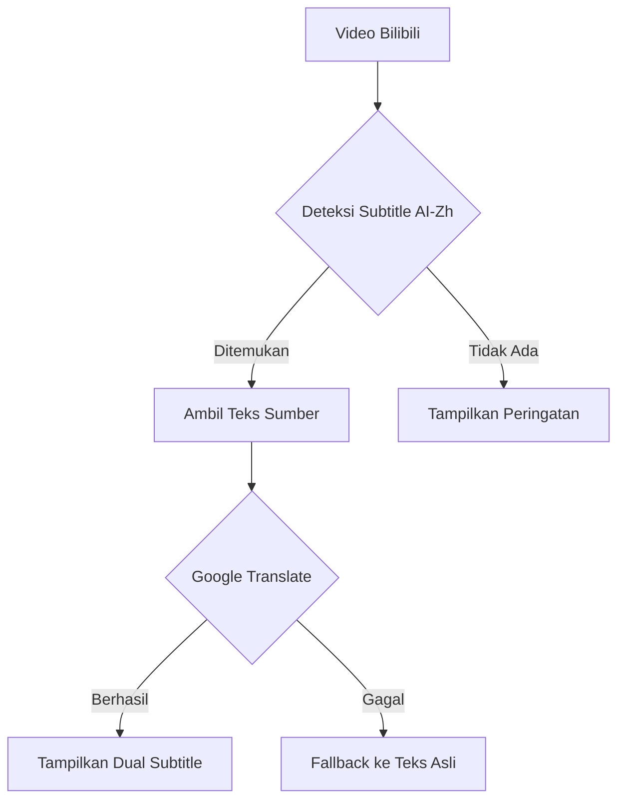

# 🌏 BiliSub

```
██████╗ ██╗██╗     ██╗███████╗██╗   ██╗██████╗ 
██╔══██╗██║██║     ██║██╔════╝██║   ██║██╔══██╗
██████╔╝██║██║     ██║███████╗██║   ██║██████╔╝
██╔══██╗██║██║     ██║╚════██║██║   ██║██╔══██╗
██████╔╝██║███████╗██║███████║╚██████╔╝██████╔╝
╚═════╝ ╚═╝╚══════╝╚═╝╚══════╝ ╚═════╝ ╚═════╝ 

     🔄 Real-time Translation | 🌍 Multi-language
```

[](./LICENSE)


[English](./README.md) | **Indonesian** | [中文](./README_ZH.md)

> 🚀 Ekstensi Chrome/Edge/Firefox yang menambahkan subtitle multi-bahasa real-time ke video Bilibili menggunakan Google Translate. Terjemahan otomatis yang langsung jalan tanpa ribet!

---

## 📷 Preview

| Pengaturan Popup | Terjemahan UI Popup | Subtitle Ganda di Video |
|:---:|:---:|:---:|
|  |  |  |

---

> [!NOTE]
> 🤝 **Asal Usul Projek**
>
> **BiliSub** dibangun di atas dua sumber inspirasi utama:
> - [**Bilibili Double Subtitle**](https://github.com/zhutoutoutousan/bilibili-double-subtitle) — **Pondasi utama**. Arsitektur subtitle ganda, mekanisme deteksi subtitle player, dan integrasi dengan Bilibili API diadopsi dari projek ini sebagai dasar.
> - [**Immersive Translation**](https://github.com/immersive-translate) — **Referensi tuning realtime**. Konsep terjemahan presisi tinggi, pendekatan zero-lag, dan UX imersif dipelajari dari projek ini lalu disesuaikan agar lebih presisi untuk use case Bilibili.
>
> Hasilnya adalah ekstensi yang ringan, cepat, dan fokus ke pengalaman menonton Bilibili tanpa hambatan.

## ⚠️ Persyaratan

> [!IMPORTANT]
> **BiliSub membutuhkan track subtitle AI untuk bisa menerjemahkan.**
>
> Ekstensi ini secara otomatis mendeteksi dan mengaktifkan track subtitle `ai-zh` / `ai-cn` / `zh-CN` (AI-Generated Chinese) dari video Bilibili. Jika video **tidak memiliki track Chinese**, ekstensi otomatis **fallback ke track `ai-en` (AI-Generated English)** sehingga terjemahan tetap berfungsi.
>
> Sebagian besar video Bilibili sudah memiliki AI subtitle. Jika belum, pastikan creator video telah mengaktifkan fitur AI subtitle.

## ✨ Fitur

- 🔄 Terjemahan subtitle real-time
- 🔘 **Toggle On/Off** — nyalakan/matikan auto-translation kapan saja lewat popup
- 🌍 Dukungan 100+ bahasa
- 🎯 Dual mode: tampilkan subtitle asli + terjemahan, atau terjemahan saja
- 🎨 Ukuran font bisa disesuaikan (Small / Medium / Large)
- 🔥 UDP-style reliability (terus jalan apapun kondisinya)
- 🎬 Styling subtitle yang bersih & rapi
- ⚡ Fallback instan ke teks asli jika terjemahan gagal
- 🛠 Tidak perlu API key
- ✅ Auto-enable subtitle AI-Zh saat video dimuat
- 🌐 **Terjemahan UI Popup** — antarmuka popup otomatis diterjemahkan ke bahasa tujuan yang dipilih

## 🚀 Instalasi

Ekstensi ini mendukung **Chrome, Edge, dan Firefox**. Pilih browser Anda:

### Chrome / Edge

1. Download atau clone repository ini
2. Buka Chrome, kunjungi `chrome://extensions/`
3. Aktifkan **Developer mode** di pojok kanan atas
4. Klik **Load unpacked** lalu pilih folder ekstensi ini
5. Buka video Bilibili apa saja — terjemahan otomatis langsung muncul!

### Firefox

1. Download atau clone repository ini
2. Rename `manifest-firefox.json` menjadi `manifest.json` di folder ekstensi
3. Buka Firefox, kunjungi `about:debugging`
4. Klik **This Firefox** (atau **Enable temporary add-ons** jika tidak muncul)
5. Klik **Load Temporary Add-on** lalu pilih file `manifest.json`
6. Buka video Bilibili apa saja — terjemahan otomatis langsung muncul!

> [!TIP]
> **Tersedia di Firefox Add-ons**
>
> BiliSub sudah tersedia di Firefox Add-ons resmi. Kamu bisa langsung install dari
> [addons.mozilla.org](https://addons.mozilla.org/en-US/firefox/addon/bilisub/), atau load manual mengikuti langkah-langkah di atas.
>
> Untuk Chromium (Chrome / Edge) belum tersedia di toko ekstensi, silakan install manual. Lihat [`PRIVACY_POLICY_EN.md`](./PRIVACY_POLICY_EN.md) untuk info privasi.

## 🎮 Cara Pakai

1. Klik icon **BiliSub** di toolbar browser
2. Pilih **bahasa tujuan** dari dropdown
3. Gunakan **switch Auto-Translation** untuk nyalakan/matikan terjemahan
4. Pilih **Subtitle Mode**: Dual Subtitles (asli + terjemahan) atau Translation Only
5. Atur **Font Size** sesuai kenyamanan
6. Selesai! Terjemahan muncul di bawah subtitle asli secara real-time

## 🌍 Bahasa yang Didukung

<details>
<summary>Klik untuk melihat daftar lengkap</summary>

- Afrikaans
- Albanian
- Amharic
- Arabic
- Armenian
- Azerbaijani
- Basque
- Belarusian
- Bengali
- Bosnian
- Bulgarian
- Catalan
- Cebuano
- Chinese (Simplified) / 中文(简体)
- Chinese (Traditional) / 中文(繁體)
- Corsican
- Croatian
- Czech
- Danish
- Dutch
- English
- Esperanto
- Estonian
- Finnish
- French
- Frisian
- Galician
- Georgian
- German
- Greek
- Gujarati
- Haitian Creole
- Hausa
- Hawaiian
- Hebrew
- Hindi
- Hmong
- Hungarian
- Icelandic
- Igbo
- Indonesian / Bahasa Indonesia
- Irish
- Italian
- Japanese / 日本語
- Javanese / Basa Jawa
- Kannada
- Kazakh
- Khmer
- Korean / 한국어
- Kurdish
- Kyrgyz
- Lao
- Latin
- Latvian
- Lithuanian
- Luxembourgish
- Macedonian
- Malagasy
- Malay
- Malayalam
- Maltese
- Maori
- Marathi
- Mongolian
- Myanmar (Burmese)
- Nepali
- Norwegian
- Nyanja (Chichewa)
- Odia (Oriya)
- Pashto
- Persian
- Polish
- Portuguese
- Punjabi
- Romanian
- Russian
- Samoan
- Scots Gaelic
- Serbian
- Sesotho
- Shona
- Sindhi
- Sinhala
- Slovak
- Slovenian
- Somali
- Spanish
- Sundanese / Basa Sunda
- Swahili
- Swedish
- Tagalog (Filipino)
- Tajik
- Tamil
- Telugu
- Thai / ภาษาไทย
- Turkish
- Ukrainian
- Urdu
- Uzbek
- Vietnamese / Tiếng Việt
- Welsh
- Xhosa
- Yiddish
- Yoruba
- Zulu

</details>

## 🛠 Teknis

Ekstensi ini menggunakan pendekatan "UDP-style" translation:



**Cara kerja:**
1. Ekstensi menyuntikkan interceptor ke halaman Bilibili untuk menangkap data subtitle
2. Secara otomatis mencari dan mengaktifkan track subtitle **ai-zh** / **ai-cn** (AI-Generated Chinese), dengan fallback ke **ai-en** (AI English) jika track Chinese tidak tersedia
3. Setiap baris subtitle diterjemahkan via Google Translate API secara real-time
4. Hasil terjemahan ditampilkan di bawah subtitle asli (dual subtitle mode)
5. Jika terjemahan gagal, teks asli tetap ditampilkan (graceful degradation)

## 🔮 Tahapan Kedepan

> [!TIP]
> Rencana pengembangan **BiliSub** ke depannya:

- **Terjemahan OCR** — Fitur utama yang sedang dikembangkan. Memungkinkan terjemahan subtitle dari video yang **tidak memiliki AI-generated subtitle**, dengan cara menangkap teks yang muncul di layar (hardsub / embedded subtitle) via OCR lalu menerjemahkannya secara real-time.
- Publikasi ke **Chrome Web Store** & **Microsoft Edge Add-ons** agar instalasi lebih mudah
- Support **multiple translation engine** (DeepL, LibreTranslate, selain Google Translate)
- **Export subtitle** ke format .srt / .ass

---

## 🤝 Kontribusi

Kontribusi sangat diterima! Silakan:

1. Fork repository ini
2. Buat branch fitur baru
3. Submit pull request

## 📝 Lisensi

MIT License — bebas digunakan untuk projek lainnya!

---

<div align="center">
Dibuat dengan ❤️ untuk komunitas Bilibili
<br>
🌟 Star kalau kamu suka projek ini!
</div>
