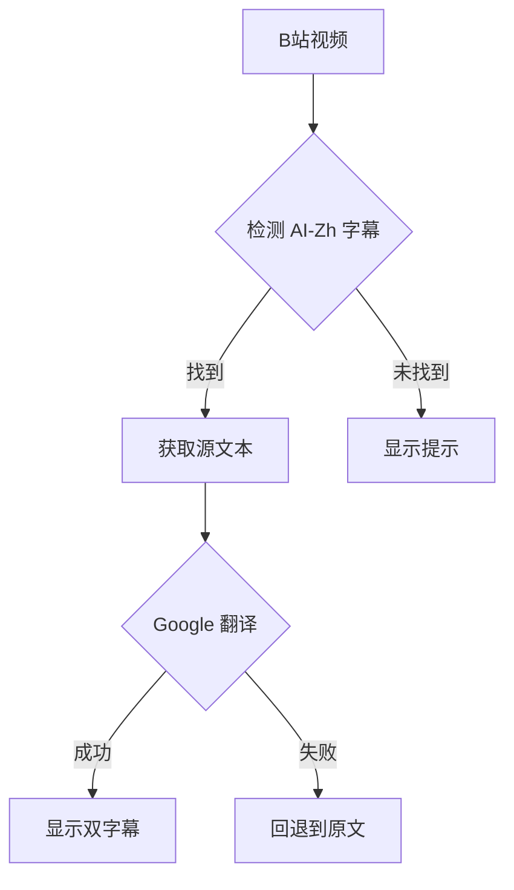

# 🌏 BiliSub

```
██████╗ ██╗██╗     ██╗███████╗██╗   ██╗██████╗ 
██╔══██╗██║██║     ██║██╔════╝██║   ██║██╔══██╗
██████╔╝██║██║     ██║███████╗██║   ██║██████╔╝
██╔══██╗██║██║     ██║╚════██║██║   ██║██╔══██╗
██████╔╝██║███████╗██║███████║╚██████╔╝██████╔╝
╚═════╝ ╚═╝╚══════╝╚═╝╚══════╝ ╚═════╝ ╚═════╝ 

     🔄 实时翻译 | 🌍 多语言支持
```

[](./LICENSE)


[English](./README.md) | [Indonesian](./README_ID.md) | **中文**

> 🚀 一款 Chrome/Edge/Firefox 浏览器扩展，使用 Google Translate 为 B站视频添加实时多语言字幕。开箱即用，即装即翻！

---

## 📷 预览

| 弹窗设置 | 视频双字幕效果 |
|:---:|:---:|
|  |  |

---

> [!NOTE]
> 🤝 **项目起源**
>
> **BiliSub** 基于两大灵感来源构建：
> - [**Bilibili Double Subtitle**](https://github.com/zhutoutoutousan/bilibili-double-subtitle) — **核心基础**。双字幕架构、播放器字幕检测机制和 Bilibili API 集成均采用自该项目。
> - [**Immersive Translation**](https://github.com/immersive-translate) — **实时调优参考**。高精度翻译概念、零延迟方法和沉浸式 UX 参考自该项目，并针对 B 站使用场景进行了适配优化。
>
> 最终呈现为一款轻量、快速、专注于流畅 B 站观看体验的扩展。

## ⚠️ 使用要求

> [!IMPORTANT]
> **BiliSub 需要 AI 字幕轨道才能进行翻译。**
>
> 本扩展会自动检测并启用 B 站视频中的 `ai-zh` / `ai-cn` / `zh-CN`（AI 生成中文）字幕轨道。如果视频**没有中文字幕轨道**，扩展会自动**回退到 `ai-en`（AI 生成英文）轨道**，翻译仍然可用。
>
> 大部分 B 站视频已配备 AI 字幕。若没有，请确保视频创作者已开启 AI 字幕功能。

## ✨ 功能特性

- 🔄 实时字幕翻译
- 🔘 **开关切换** — 通过弹窗随时启用/关闭自动翻译
- 🌍 支持 100+ 种语言
- 🎯 双模式：显示原文+翻译，或仅显示翻译
- 🎨 可调节字体大小（小 / 中 / 大）
- 🔥 UDP 式可靠性（无论何种情况持续运行）
- 🎬 干净整洁的字幕样式
- ⚡ 翻译失败时即时回退到原文
- 🛠 无需 API 密钥
- ✅ 视频加载时自动启用 AI-Zh 字幕

## 🚀 安装方法

本扩展支持 **Chrome、Edge 和 Firefox**。请选择您的浏览器：

### Chrome / Edge

1. 下载或克隆本仓库
2. 打开 Chrome，访问 `chrome://extensions/`
3. 在右上角启用**开发者模式**
4. 点击**加载已解压的扩展程序**，选择本扩展文件夹
5. 打开任意 B 站视频 — 自动翻译即刻生效！

### Firefox

1. 下载或克隆本仓库
2. 将 `manifest-firefox.json` 重命名为 `manifest.json` 放在扩展文件夹中
3. 打开 Firefox，访问 `about:debugging`
4. 点击**This Firefox**（或**启用临时附加组件**如果看不到）
5. 点击**加载临时附加组件**，选择 `manifest.json` 文件
6. 打开任意 B 站视频 — 自动翻译即刻生效！

> [!TIP]
> **暂未上架应用商店**
>
> 目前 BiliSub 仅支持手动安装（加载已解压的扩展程序）。上架 Chrome Web Store 和 Microsoft Edge Add-ons 的计划已在路线图中。

## 🎮 使用方法

1. 点击浏览器工具栏中的 **BiliSub** 图标
2. 从下拉菜单中选择**目标语言**
3. 使用**自动翻译开关**来开启/关闭翻译
4. 选择**字幕模式**：双字幕（原文+翻译）或仅翻译
5. 根据需要调整**字体大小**
6. 完成！翻译内容将实时显示在原文字幕下方

## 🌍 支持的语言

<details>
<summary>点击展开完整列表</summary>

- 南非语 / Afrikaans
- 阿尔巴尼亚语 / Albanian
- 阿姆哈拉语 / Amharic
- 阿拉伯语 / العربية
- 亚美尼亚语 / Հայերեն
- 阿塞拜疆语 / Azərbaycan
- 巴斯克语 / Euskara
- 白俄罗斯语 / Беларуская
- 孟加拉语 / বাংলা
- 波斯尼亚语 / Bosanski
- 保加利亚语 / Български
- 加泰罗尼亚语 / Català
- 宿务语 / Cebuano
- 简体中文 / 中文(简体)
- 繁体中文 / 中文(繁體)
- 科西嘉语 / Corsu
- 克罗地亚语 / Hrvatski
- 捷克语 / Čeština
- 丹麦语 / Dansk
- 荷兰语 / Nederlands
- 英语 / English
- 世界语 / Esperanto
- 爱沙尼亚语 / Eesti
- 芬兰语 / Suomi
- 法语 / Français
- 弗里斯兰语 / Frysk
- 加利西亚语 / Galego
- 格鲁吉亚语 / ქართული
- 德语 / Deutsch
- 希腊语 / Ελληνικά
- 古吉拉特语 / ગુજરાતી
- 海地克里奥尔语 / Kreyòl ayisyen
- 豪萨语 / Hausa
- 夏威夷语 / ʻŌlelo Hawaiʻi
- 希伯来语 / עברית
- 印地语 / हिन्दी
- 苗语 / Hmoob
- 匈牙利语 / Magyar
- 冰岛语 / Íslenska
- 伊博语 / Igbo
- 印尼语 / Bahasa Indonesia
- 爱尔兰语 / Gaeilge
- 意大利语 / Italiano
- 日语 / 日本語
- 爪哇语 / Basa Jawa
- 卡纳达语 / ಕನ್ನಡ
- 哈萨克语 / Қазақша
- 高棉语 / ខ្មែរ
- 朝鲜语 / 한국어
- 库尔德语 / Kurdî
- 吉尔吉斯语 / Кыргызча
- 老挝语 / ລາວ
- 拉丁语 / Latina
- 拉脱维亚语 / Latviešu
- 立陶宛语 / Lietuvių
- 卢森堡语 / Lëtzebuergesch
- 马其顿语 / Македонски
- 马拉加斯语 / Malagasy
- 马来语 / Bahasa Melayu
- 马拉雅拉姆语 / മലയാളം
- 马耳他语 / Malti
- 毛利语 / Māori
-马拉地语 / मराठी
- 蒙古语 / Монгол
- 缅甸语 / မြန်မာစာ
- 尼泊尔语 / नेपाली
- 挪威语 / Norsk
- 尼扬扎语 / Nyanja
- 奥里亚语 / ଓଡ଼ିଆ
- 普什图语 / پښتو
- 波斯语 / فارسی
- 波兰语 / Polski
- 葡萄牙语 / Português
- 旁遮普语 / ਪੰਜਾਬੀ
- 罗马尼亚语 / Română
- 俄语 / Русский
- 萨摩亚语 / Samoan
- 苏格兰盖尔语 / Gàidhlig
- 塞尔维亚语 / Српски
- 塞索托语 / Sesotho
- 绍纳语 / Shona
- 信德语 / سنڌي
- 僧伽罗语 / සිංහල
- 斯洛伐克语 / Slovenčina
- 斯洛文尼亚语 / Slovenščina
- 索马里语 / Soomaali
- 西班牙语 / Español
- 巽他语 / Basa Sunda
- 斯瓦希里语 / Kiswahili
- 瑞典语 / Svenska
- 他加禄语 / Filipino
- 塔吉克语 / Тоҷикӣ
- 泰米尔语 / தமிழ்
- 泰卢固语 / తెలుగు
- 泰语 / ภาษาไทย
- 土耳其语 / Türkçe
- 乌克兰语 / Українська
- 乌尔都语 / اردو
- 乌兹别克语 / O'zbekcha
- 越南语 / Tiếng Việt
- 威尔士语 / Cymraeg
- 科萨语 / Xhosa
- 意第绪语 / ייִדיש
- 约鲁巴语 / Yorùbá
- 祖鲁语 / Zulu

</details>

## 🛠 技术细节

本扩展采用 "UDP 式" 翻译方案：



**工作原理：**
1. 扩展向 B 站页面注入拦截器以捕获字幕数据
2. 自动查找并启用 **ai-zh** / **ai-cn**（AI 生成中文）字幕轨道，若无中文字幕则回退到 **ai-en**（AI 英文）
3. 每行字幕通过 Google Translate API 进行实时翻译
4. 翻译结果显示在原文字幕下方（双字幕模式）
5. 若翻译失败，仍显示原文（优雅降级）

## 🔮 未来规划

> [!TIP]
> **BiliSub** 的未来开发计划：

- **OCR 翻译** — 正在开发的主要功能。使没有 **AI 生成字幕**的视频也能进行字幕翻译，通过 OCR 捕获屏幕上出现的文本（硬字幕/内嵌字幕），然后实时翻译。
- 上架 **Chrome Web Store** 和 **Microsoft Edge Add-ons** 以便更轻松地安装
- 支持**多种翻译引擎**（DeepL、LibreTranslate，以及 Google Translate）
- **导出字幕**为 .srt / .ass 格式

---

## 🤝 贡献代码

欢迎贡献！请：

1. Fork 本仓库
2. 创建功能分支
3. 提交 Pull Request

## 📝 许可证

MIT 许可证 — 可自由用于你自己的项目！

---

<div align="center">
用 ❤️ 为 B 站社区打造
<br>
🌟 觉得有用就点个 Star 吧！
</div>
